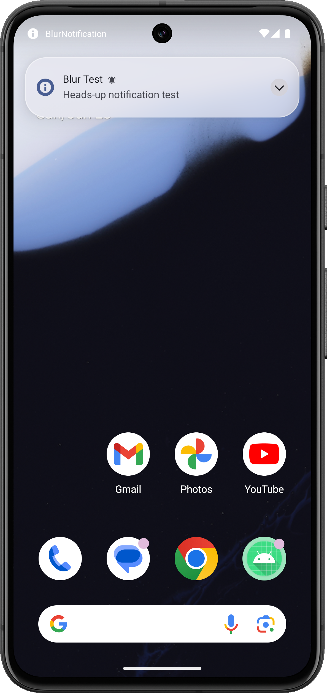

# BlurNotification

An LSPosed/Xposed module for Android 15 that adds dynamic blur to heads-up notifications in `SystemUI`.

## Preview



## Features

- Hooks `SystemUI` HUN background rendering
- Applies cross-window blur to heads-up notifications
- Keeps a translucent foreground tint that follows system background color and dark mode
- Includes a test app for sending HUN notifications
- Includes runtime controls for blur radius and tint alpha

## Project Layout

- `app/src/main/java/com/oleg/blur/mod/MainHook.java`
  Xposed entry point and `SystemUI` hook logic
- `app/src/main/java/com/oleg/blur/mod/MainActivity.java`
  Test UI for posting HUN notifications and tuning blur parameters

## Requirements

- Android 15
- LSPosed/Xposed
- Cross-window blur enabled on the device
- Root access if you want to restart `SystemUI` from the app

## Build

```bash
./gradlew :app:assembleDebug
```

Output APK:

`app/build/outputs/apk/debug/app-debug.apk`

## Usage

1. Install the APK.
2. Enable the module in LSPosed for `SystemUI`.
3. Reboot or restart `SystemUI`.
4. Open the app and grant notification permission.
5. Adjust `Foreground Tint Alpha` and `Blur Radius`.
6. Send a heads-up notification to verify the effect.

## Notes

- The module reads its runtime config from external storage so the `SystemUI` process can access it.
- Visual quality depends on device blur pipeline and emulator rendering quality.
